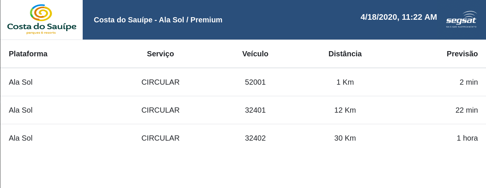

<h4 align="center">
 Web Scraping, que exibe previsão de chegada de veiculos.
</h4>

O painel Gbus fui uma iniciativa de personalização de um painel já existente. Criei uma aplicação em nodejs que realiza um Scraping(coleta informação de um site existente), armazena os dados da viagem, processa-os aplicando alguns filtros e exibe em com uma cara nova.

## ⚙️ Ferramentas

- [Node.js][nodejs]
- [Express][express]
- [Bootstrap][bootstrap]
- [Angular][angular]
- [pug][pug]
- [JSDOM][jsdom]

Feito com ♥ por Álefe Cruz :wave: [Entre em contato!](https://www.alefecruz.com.br/)

[nodejs]:https://nodejs.org/
[express]:https://nodejs.org/
[bootstrap]:https://getbootstrap.com/
[angular]:https://angularjs.org/
[pug]:https://pugjs.org/api/getting-started.html
[jsdom]:https://www.npmjs.com/package/jsdom
